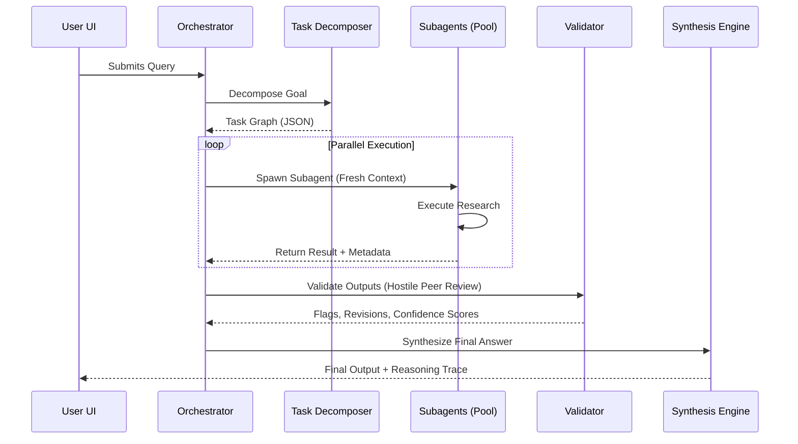
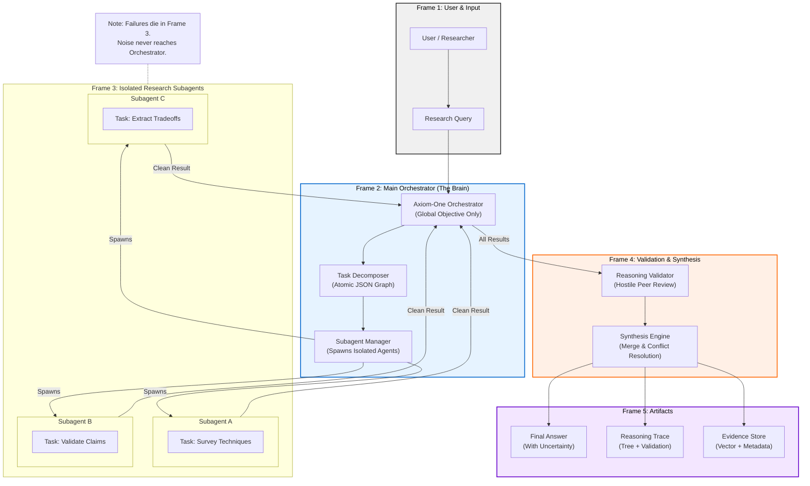

### A Research-Grade Reasoning System (Not a Chatbot)


> **"Build a thinking-first research agent that decomposes problems, runs multi-step reasoning loops, validates its own outputs, and exposes the entire thought pipeline to the user."**

This project is about **epistemic rigor**, not vibes.

---

## 1. Product Definition

### What Axiom-One Does
Axiom-One is a **research execution engine** that:
- Accepts a complex question or goal.
- Breaks it into **atomic research tasks**.
- Executes them in parallel and sequentially.
- Cross-validates results.
- Produces:
    - A final answer.
    - A transparent reasoning trace.
    - Structured artifacts (notes, citations, assumptions).

### What It Is NOT
- Not a chat UI with memory slapped on.
- Not a “personal assistant”.
- Not a prompt wrapper.
*If it can’t explain why it believes something, it shuts up.*

---

## 2. Technical Architecture

### Blueprint (Subagent-Driven Research)
The architecture follows a strict "Hub-and-Spoke" model where a central Orchestrator manages specialized modules. This ensures context cleanliness and prevents hallucination cascades.

#### High-Level Sequence


#### System Component Blueprint (The "FigJam" Model)



---

## 3. Core Modules (The Real Meat)

### 1️⃣ Task Decomposer (Brain Stem)
*   **Input:** User query.
*   **Output:** Structured task graph (JSON).
*   **Implementation:** Gemini 3 Pro in *Thinking Mode* with deterministic temperature.

### 2️⃣ Research Executor Pool
*   **Concept:** Each task becomes an **independent execution unit**.
*   **Architecture:** Stateless workers. Each worker receives a task + context slice, calls the LLM, and stores the result + confidence score.
*   **Why:** No long chats. No rambling. Context is ephemeral.

### 3️⃣ Evidence Store (Truth Backbone)
*   **Vector Store:** Task outputs and semantic chunks.
*   **Metadata DB:** Task ID, Assumptions, Confidence, Source type.
*   *Prevents hallucinations from pretending to be facts.*

### 4️⃣ Reasoning Validator (The Adult in the Room)
*   **Checks:** Contradictions, unsupported claims, circular reasoning.
*   **Implementation:** Secondary Gemini pass prompted as a "hostile peer reviewer".

### 5️⃣ Synthesis Engine
*   **Responsibilities:** Merge task outputs, resolve conflicts, and produce the final answer with a "What could be wrong" section.

---

## 4. MVP Scope & Tech Stack

### Tech Stack
*   **Current MVP (This Repo):** React + Vite (Frontend Focus)
*   **Target Architecture:** Next.js + FastAPI + Python (Full Agentic System)
*   **LLM:** Gemini 3 Pro (Thinking enabled)
*   **Storage:** Vector DB (Pinecone/FAISS) + Postgres/SQLite

### MVP Features (Locked)
*   ✅ **Input:** Single complex research question.
*   ✅ **Output:** Final synthesized answer, task breakdown, reasoning trace.
*   ✅ **UI:** Simple web interface (Task Tree left, Outputs right).

### NOT in MVP
*   Multi-user collaboration
*   Long-term memory (beyond current session)
*   Real-time streaming
*   Agent self-improvement loops

---

## 5. Development Setup

This repository contains the **Frontend** implementation using React and Vite.

### Prerequisites
*   Node.js (v18+)
*   Google Gemini API Key

### Installation

1.  **Clone the repository:**
    ```bash
    git clone https://github.com/yourusername/axiom-one.git
    cd axiom-one
    ```

2.  **Install dependencies:**
    ```bash
    npm install
    ```

3.  **Configure Environment:**
    Create a `.env` file in the root directory and add your API Key:
    ```env
    GEMINI_API_KEY=your_gemini_api_key_here
    ```

4.  **Run the Development Server:**
    ```bash
    npm run dev
    ```

---

## 6. Why Axiom-One Matters

Most “AI agents” optimize for fluency, hide uncertainty, and collapse under scrutiny.
**Axiom-One optimizes for correctness under pressure**, makes uncertainty explicit, and treats reasoning as a first-class artifact.
