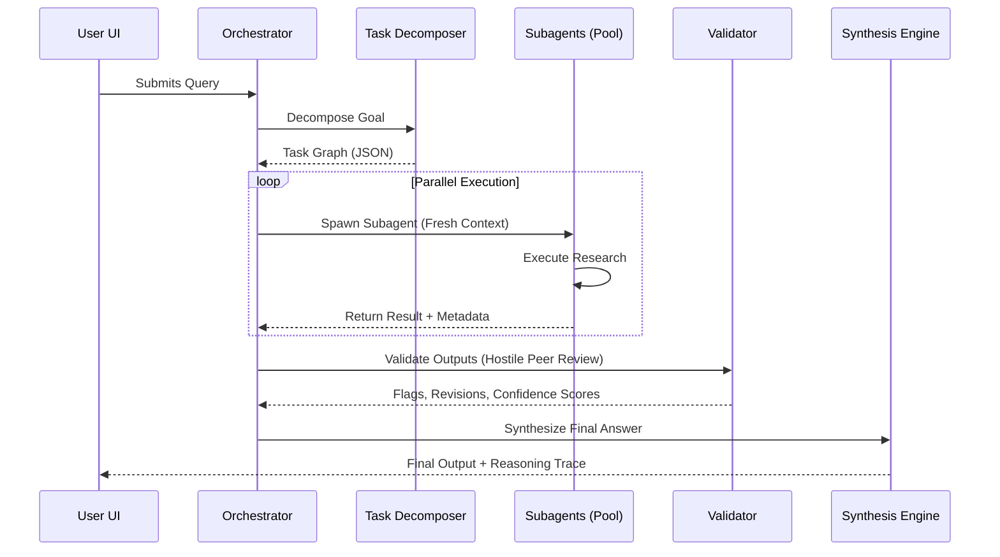

# AXIOM-ONE
### A Research-Grade Reasoning System (Not a Chatbot)

> **"Build a thinking-first research agent that decomposes problems, runs multi-step reasoning loops, validates its own outputs, and exposes the entire thought pipeline to the user."**

This project is about **epistemic rigor**, not vibes.

---

## 1. Product Definition

### What Axiom-One Does
Axiom-One is a **research execution engine** that:
- Accepts a complex question or goal.
- Breaks it into **atomic research tasks**.
- Executes them in parallel and sequentially.
- Cross-validates results.
- Produces:
    - A final answer.
    - A transparent reasoning trace.
    - Structured artifacts (notes, citations, assumptions).

### What It Is NOT
- Not a chat UI with memory slapped on.
- Not a “personal assistant”.
- Not a prompt wrapper.
*If it can’t explain why it believes something, it shuts up.*

---

## 2. Technical Architecture

### System Overview
The architecture follows a "Hub-and-Spoke" model where a central Orchestrator manages specialized modules. This ensures context cleanliness and prevents hallucination cascades.



### Core Modules

#### 1️⃣ Task Decomposer (Brain Stem)
*   **Function:** Breaks down complex queries into a structured task graph (JSON).
*   **Implementation:** Gemini 3 Pro (Thinking Mode) with deterministic settings.

#### 2️⃣ Research Executor Pool
*   **Function:** Stateless workers that execute individual tasks (summarization, analysis, assumption extraction).
*   **Key Feature:** Each worker gets a fresh context slice. No long chats.

#### 3️⃣ Evidence Store (Truth Backbone)
*   **Vector Store:** Task outputs and semantic chunks.
*   **Metadata DB:** Task IDs, assumptions, confidence scores, and source types (reasoned/inferred/factual).

#### 4️⃣ Reasoning Validator (The Adult in the Room)
*   **Role:** Acts as a "hostile peer reviewer".
*   **Checks:** Contradictions, unsupported claims, circular reasoning, and overconfidence.

#### 5️⃣ Synthesis Engine
*   **Function:** Merges validated outputs to produce the final answer, assumption list, and "What could be wrong" section.

---

## 3. MVP Scope

### Features (Locked)
*   **Input:** Single complex research question with optional context.
*   **Output:** Final synthesized answer, task breakdown, reasoning trace (collapsed), and confidence score.
*   **UI:** Simple web interface with a Task Tree (left) and Outputs (right).

### Tech Stack
*   **Frontend:** React + Vite (Current Implementation) / Next.js (Vision)
*   **Backend:** Node / FastAPI
*   **LLM:** Gemini 3 Pro (Thinking enabled)
*   **Storage:** Vector DB (Pinecone/FAISS) + Postgres/SQLite

---

## 4. Development Setup

This repository contains the **Frontend** implementation using React and Vite.

### Prerequisites
*   Node.js (v18+)
*   Google Gemini API Key

### Installation

1.  **Clone the repository:**
    ```bash
    git clone https://github.com/yourusername/axiom-one.git
    cd axiom-one
    ```

2.  **Install dependencies:**
    ```bash
    npm install
    ```

3.  **Configure Environment:**
    Create a `.env` file in the root directory and add your API Key:
    ```env
    GEMINI_API_KEY=your_gemini_api_key_here
    ```

4.  **Run the Development Server:**
    ```bash
    npm run dev
    ```

5.  **Build for Production:**
    ```bash
    npm run build
    ```

---

## 5. Why Axiom-One Matters

Most “AI agents” optimize for fluency, hide uncertainty, and collapse under scrutiny.
**Axiom-One optimizes for correctness under pressure**, makes uncertainty explicit, and treats reasoning as a first-class artifact.

This is how we earn respect from researchers, serious engineers, and investors.
