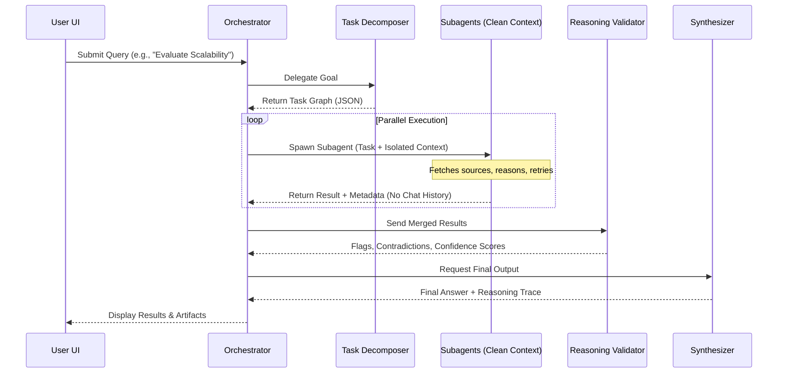

# AXIOM-ONE

### A Research-Grade Reasoning System (Not a Chatbot)

> **MVP Goal:** Build a thinking-first research agent that decomposes problems, runs multi-step reasoning loops, validates its own outputs, and exposes the entire thought pipeline to the user. This is about **epistemic rigor**, not vibes.

---

## 1. PRODUCT DEFINITION (CRISP)

### What Axiom-One Does
Axiom-One is a **research execution engine** that:
- Accepts a complex question or goal
- Breaks it into **atomic research tasks**
- Executes them in parallel and sequentially
- Cross-validates results
- Produces:
    - A final answer
    - A transparent reasoning trace
    - Structured artifacts (notes, citations, assumptions)

### What It Is NOT
- Not a chat UI with memory slapped on
- Not a “personal assistant”
- Not a prompt wrapper

If it can’t explain *why* it believes something, it shuts up.

---

## 2. TECHNICAL ARCHITECTURE (AXIOM-ONE CORE)

### A. SYSTEM OVERVIEW

The system follows an agentic but disciplined architecture, orchestrating specialized modules to ensure correctness.



### B. CORE MODULES

#### 1️⃣ Task Decomposer (Brain Stem)
*   **Input:** Complex user query.
*   **Output:** Structured task graph (JSON).
*   **Role:** Breaks down the problem into atomic units (e.g., Define terms, Survey techniques, Analyze tradeoffs).

#### 2️⃣ Research Executor Pool
*   **Role:** Each task becomes an independent execution unit.
*   **Architecture:** Stateless workers. Each worker receives a task + context slice, calls the LLM, and returns a result with a confidence score.
*   **Key:** No long chats. No rambling.

#### 3️⃣ Evidence Store (Truth Backbone)
*   **Vector Store:** Task outputs, semantic chunks.
*   **Metadata DB:** Task IDs, Assumptions, Confidence, Source types.
*   **Purpose:** Prevents hallucinations from pretending to be facts.

#### 4️⃣ Reasoning Validator (The Adult in the Room)
*   **Checks:** Contradictions, unsupported claims, circular reasoning.
*   **Implementation:** Secondary pass prompted as a "hostile peer reviewer".
*   **Output:** Flags, required revisions, confidence downgrades.

#### 5️⃣ Synthesis Engine
*   **Role:** Merges task outputs, resolves conflicts, and produces the final answer with an assumption list and confidence score.

---

## 3. MVP SCOPE

### Features (Locked)
*   **Input:** Single complex research question.
*   **Output:** Final synthesized answer, Task breakdown, Reasoning trace (collapsed by default), Confidence score.
*   **UI:** Simple web interface (Task tree on left, outputs on right).
*   **Tech Stack:**
    *   Frontend: React / Vite
    *   LLM: Gemini 3 Pro (Thinking enabled)

### NOT in MVP
*   Multi-user collaboration
*   Long-term memory
*   File uploads
*   Real-time streaming
*   Agent self-improvement loops

---

## 4. WHY AXIOM-ONE MATTERS

Most “AI agents” optimize for fluency, hide uncertainty, and collapse under scrutiny.

**Axiom-One optimizes for correctness under pressure.** It makes uncertainty explicit and treats reasoning as a first-class artifact. This is designed for researchers, serious engineers, and those who need epistemic rigor.

---

## 5. GETTING STARTED

This repository contains the MVP implementation of the Axiom-One client.

### Prerequisites
*   Node.js (v18+)
*   A Google Gemini API Key

### Installation

1.  **Clone the repository:**
    ```bash
    git clone https://github.com/your-org/axiom-one.git
    cd axiom-one
    ```

2.  **Install dependencies:**
    ```bash
    npm install
    ```

3.  **Configure Environment:**
    Create a `.env` file in the root directory (or `.env.local`) and add your API key:
    ```env
    VITE_GEMINI_API_KEY=your_api_key_here
    ```

4.  **Run the application:**
    ```bash
    npm run dev
    ```

5.  **Open in Browser:**
    Navigate to `http://localhost:5173` to access the Axiom-One interface.
