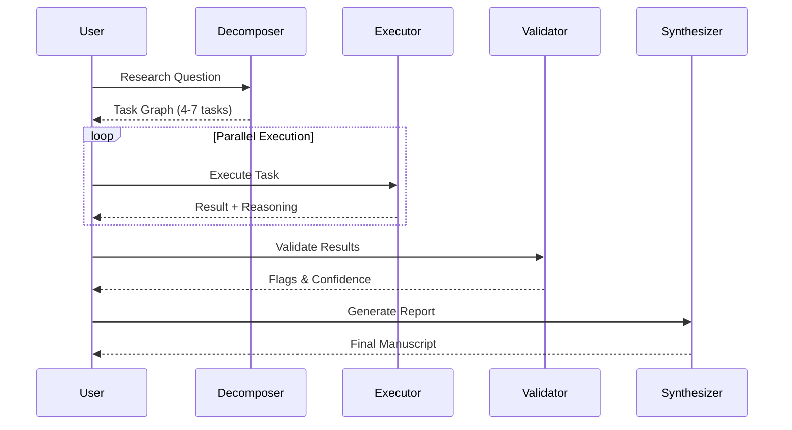

# AXIOM-ONE Research Execution Engine

### A Research-Grade Reasoning System (Not a Chatbot)


> **"Build a thinking-first research agent that decomposes problems, runs multi-step reasoning loops, validates its own outputs, and exposes the entire thought pipeline to the user."**

This project is about **epistemic rigor**, not vibes.

---

## Features

- **Task Decomposition**: Breaks complex questions into 4-7 atomic research tasks
- **Subagent Execution**: Each task runs in isolation with full reasoning traces
- **Adversarial Validation**: Hostile peer review catches contradictions and unsupported claims
- **Manuscript Synthesis**: Produces structured, inspectable research reports
- **Real-time Progress**: Live task tree updates with streaming progress
- **Export Options**: Copy to clipboard or download as Markdown (PDF coming in v2)
- **Keyboard Shortcuts**: Full accessibility support (Ctrl+Enter, ESC, Arrow keys)
- **Cancel/Abort**: Stop long-running executions gracefully

---

## Architecture

### The Pipeline: Decompose → Execute → Validate → Synthesize



---

## Installation

### Prerequisites
- Node.js (v18+)
- Google Gemini API Key

### Setup

1. **Clone the repository:**
   ```bash
   git clone https://github.com/yourusername/axiom-one.git
   cd axiom-one
   ```

2. **Install dependencies:**
   ```bash
   npm install
   ```

3. **Configure environment:**
   ```bash
   cp .env.example .env
   # Edit .env and add your Gemini API key
   ```

4. **Run development server:**
   ```bash
   npm run dev
   ```

---

## Usage

1. Enter a research question (minimum 20 characters)
2. Click "Initialize Audit" or press Ctrl+Enter
3. Watch as the system decomposes your question into tasks
4. Monitor real-time progress as subagents execute
5. Review the final manuscript with confidence scores
6. Export results via Copy to Clipboard or Download MD

---

## Tech Stack

- **Frontend**: React + TypeScript + Vite
- **Styling**: Tailwind CSS + Custom CSS Variables
- **UI Components**: shadcn/ui
- **LLM**: Google Gemini 2.0 Flash Thinking
- **State**: React hooks with streaming updates

---

## Development

### Build for production:
```bash
npm run build
```

### Type checking:
```bash
npx tsc --noEmit
```

---

## Why Axiom-One Matters

Most "AI agents" optimize for fluency, hide uncertainty, and collapse under scrutiny.

**Axiom-One optimizes for correctness under pressure**, makes uncertainty explicit, and treats reasoning as a first-class artifact.

---

## License

MIT
